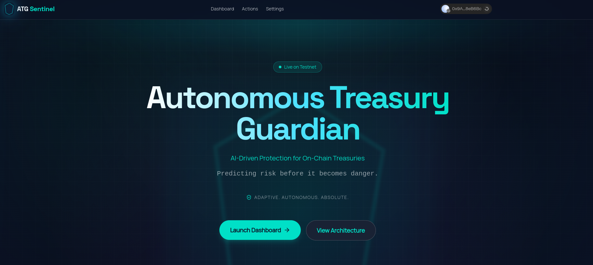
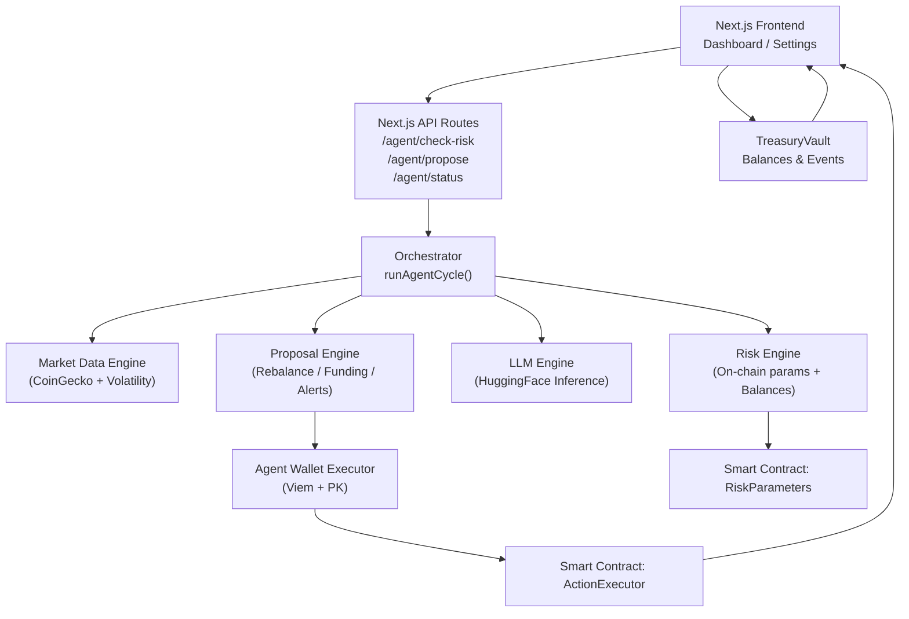
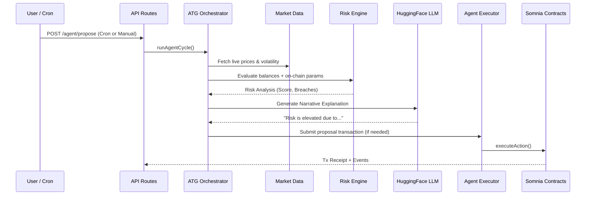

# Autonomous Treasury Guardian (ATG)




**Autonomous Treasury Guardian** is a decentralized, AI-powered treasury management system designed for DAOs and organizations Somnia. By bridging on-chain transparency with off-chain AI intelligence, ATG automates risk management, asset rebalancing, and operational payments, ensuring treasury health and sustainability without constant human intervention.

## 🌟 Core Features

### 🤖 AI-Driven Autonomy
- **Risk Engine**: Continuous, real-time monitoring of market volatility (via CoinGecko) and vault health.
- **Narrative Reasoning**: Integrated LLM (Mistral/Zephyr-7B via HuggingFace) generates human-readable explanations for every risk assessment and proposal.
- **Automated Proposals**: The AI agent proactively proposes rebalances (e.g., WSOMI/USDC swaps) when risk thresholds are breached or portfolio allocation drifts.
- **Agent API**: Dedicated Next.js API routes (`/api/agent/*`) for on-demand risk evaluation and on-chain action triggering.
- **Intelligent Execution**: Secure server-side signer (Viem) automatically submits proposals to the `ActionExecutor` contract.
- **Autonomous Scheduling**: Vercel Cron integration ensures the agent runs checks every 10 minutes without manual triggers.

### 🛡️ Advanced Governance
- **Role-Based Access Control**: Granular permissions via `PermissionManager` (Governance, Executor, Agent roles).
- **On-Chain Risk Parameters**: Immutable yet adjustable thresholds for max rebalance size, volatility limits, and runway requirements.
- **Guardian Controls**: Emergency system pause/unpause and instant role revocation capabilities.

### 🏛️ Treasury Dashboard
- **Real-Time Monitoring**: Live visualization of treasury balances (WSOMI, USDC) fetched from on-chain and priced via CoinGecko.
- **Live Risk Gauge**: Dynamic risk scoring based on real-time market volatility and on-chain parameters.
- **Activity Feed**: Immutable, transparent log of all agent proposals, executed actions, and AI narratives/telemetry.
- **Interactive Settings**: Intuitive UI for managing risk configurations and assigning system roles.

## 🏗️ System Architecture

The system consists of three integrated layers: Smart Contracts, the AI Agent Layer, and the User Frontend.

### Architecture Diagram



### AI Workflow Sequence



## 🚀 Deployed Contracts (Somnia testnet)

| Contract | Address |
|----------|---------|
| **TreasuryVault** | `0x6935B8ADD1ad176b73370F45b603Df30a303EF02` |
| **ActionExecutor** | `0x7fE17fCd269B07404062f42aCf6e1f131086C97F` |
| **RiskParameters** | `0x995BC7ddeDB7B869cEd9ef3698D0272e2d177A9C` |
| **PermissionManager** | `0x3dBBd27D26d2AA3ed321A785C0513969f1fB23B8` |
| **AgentAuth** | `0xc2dFD5Cb92decB685787cEDC536046CBC251fe2A` |
| **MockSwap** | `0x936F59DA9c4E8961E128771FCCF4c015A9256911` |

## 🛠️ Getting Started

### Prerequisites
- Node.js 20+
- pnpm or npm
- An Somnia Testnet wallet with funds

### Installation

1.  **Clone the repository**
    ```bash
    git clone git@github.com:Bratipah/ATG.git
    cd autonomous-treasury-guardian
    ```

2.  **Install dependencies**
    ```bash
    pnpm install
    ```

3.  **Configure Environment**
    Create a `.env.local` file:
    ```env
    # Blockchain
    NEXT_PUBLIC_CHAIN_ID=43113
    NEXT_PUBLIC_RPC_URL=https://api.avax-test.network/ext/bc/C/rpc
    
    # Contract Addresses (Already configured in lib/contracts.ts defaults)
    NEXT_PUBLIC_TREASURY_VAULT_ADDRESS=0x6935B8ADD1ad176b73370F45b603Df30a303EF02
    NEXT_PUBLIC_ACTION_EXECUTOR_ADDRESS=0x7fE17fCd269B07404062f42aCf6e1f131086C97F
    NEXT_PUBLIC_RISK_PARAMETERS_ADDRESS=0x995BC7ddeDB7B869cEd9ef3698D0272e2d177A9C
    NEXT_PUBLIC_PERMISSION_MANAGER_ADDRESS=0x3dBBd27D26d2AA3ed321A785C0513969f1fB23B8
    NEXT_PUBLIC_AGENT_AUTH_ADDRESS=0xc2dFD5Cb92decB685787cEDC536046CBC251fe2A
    
    # Agent Configuration (Backend)
    AGENT_PRIVATE_KEY=0x... # Private key for the server-side agent wallet
    HF_ACCESS_TOKEN=hf_... # Hugging Face Token for LLM narratives

    # Reown / WalletConnect
    NEXT_PUBLIC_WALLETCONNECT_PROJECT_ID=your_project_id
    ```

4.  **Run the Development Server**
    ```bash
    pnpm dev
    ```

## 🧪 Usage Guide

### 1. Dashboard
Visit the main dashboard to see the current "Runway Status", "Risk Gauge", and "Activity Feed". The activity feed updates in real-time via contract event listeners and server-side agent logs.

### 2. Risk Configuration
Navigate to **Settings**. Here you can:
- Update `Max Rebalance BPS` (e.g., 500 for 5%).
- Update `Volatility Threshold`.
- Update `Min Runway Months`.
*Note: You must have the Governance role to update these.*

### 3. Role Management
In **Settings**, use the **Access Control** panel to:
- Assign the `AGENT` role to your server-side wallet.
- Grant `EXECUTOR` roles to trusted team members.

### 4. Testing the Agent
You can manually trigger the AI risk analysis by hitting the API endpoint:
```bash
curl -X POST http://localhost:3000/api/agent/propose
```
If a risk is detected, the agent will generate a narrative explanation and propose a remedial action on-chain.

## 🔒 Security

- **Private Keys**: The frontend never accesses your private keys. The `AGENT_PRIVATE_KEY` is only used server-side for the automated agent.
- **Permissioned Execution**: Even if the agent proposes an action, it must pass on-chain validation checks in `ActionExecutor`.
- **Rate Limiting**: Agent endpoints should be protected in production.

---

Built with ❤️ on Somnia.
# ATG
